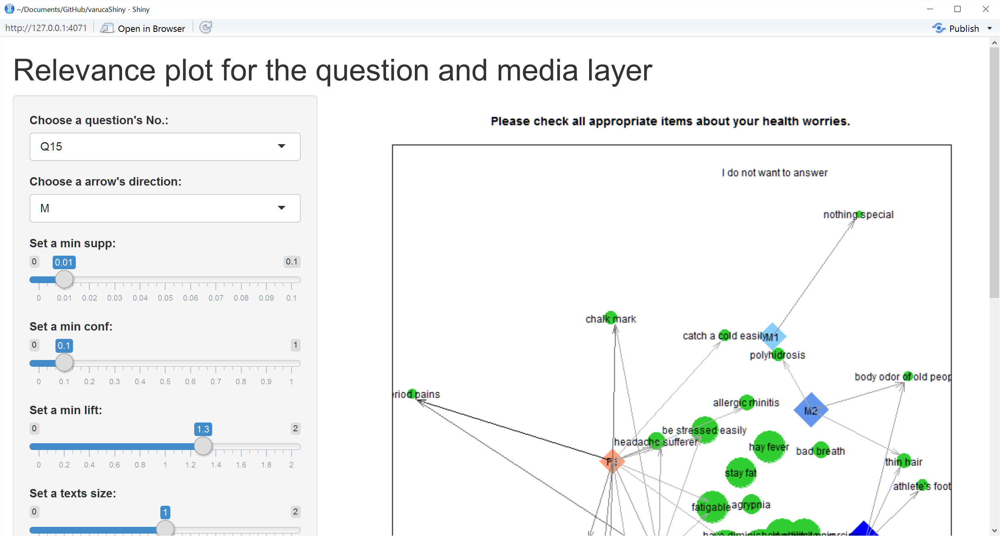

[](http://quantlet.de/index.php?p=info)

## [](http://quantlet.de/) **VarucaShiny** [](http://quantlet.de/d3/ia)

```yaml

Name of Quantlet : VarucaShiny

Published in : 'Visualization of cross tabulation by the Association rules by using the
Correspondence analysis: Compstat2016'

Description : 'Shiny application of the Visualization of cross tabulation of questionnaire by media
layers based on gender and age. The visualization used association rules and the biplot of
correspondence analysis.'

Keywords : questionnaire, association rules, correspondence analysi

Author[New] : Sanetoshi Yamada and Yoshiro Yamamoto

Submitted : 2016-07-22, Yoshiro Yamamoto

Output : Plot of the association rule plot using the biplot of the correspondence analysis.

```




### R Code:
```r
require(devtools)
require(shiny)
runApp(paste(getwd(),"/ShinyApp/varucashiny",sep = ""))

```
